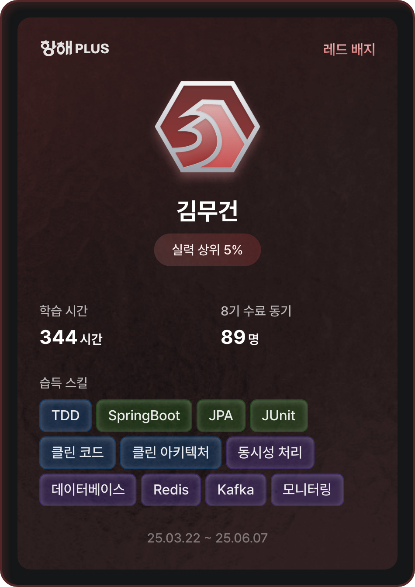

# ⚓️ 항해플러스 - 이커머스 프로젝트

> 대용량 트래픽을 견디는 실전 이커머스 플랫폼  
> _"선착순 쿠폰 이벤트에서 300명이 동시에 몰려도 끄떡없는 시스템"

<div align="center">
  
</div>

## 🤔 이 프로젝트는 왜 만들어졌나요?

흔히 볼 수 있는 간단한 쇼핑몰이 아닙니다. **실제 서비스에서 겪는 까다로운 문제들**을 해결하기 위해 만들어진 프로젝트예요.

- 💥 **선착순 이벤트 때 서버가 터지는 문제** → Redis 분산락과 Kafka로 해결
- 🐌 **상품 조회가 느려지는 문제** → 다층 캐시 전략으로 해결  
- 🔄 **재고 동기화 문제** → 이벤트 드리븐 아키텍처로 해결
- 📊 **장애 상황을 모르는 문제** → 모니터링과 알림 시스템으로 해결

## ⚡ 핵심 특징

```yaml
🎯 실전 경험: 실제 운영 환경에서 발생하는 문제들을 시뮬레이션
🚀 고성능: 300+ TPS 선착순 쿠폰 발급 처리 가능
🛡️ 안정성: Redis Sentinel 클러스터 + Kafka 클러스터로 무중단 서비스
📈 확장성: MSA 구조로 언제든 서비스 분리 가능
🔍 관찰성: Prometheus 메트릭으로 모든 것을 추적
```

## 🏗️ 아키텍처 한눈에 보기

### 🔥 선착순 쿠폰 시스템
한정 수량 쿠폰을 놓고 수백명이 동시에 요청할 때의 실제 상황을 구현했습니다.

```text
요청 흐름: 사용자 → Spring Boot → Redis 분산락 → 쿠폰 차감 → Kafka 이벤트
```

### 🎯 기술 스택

**Backend**
- Spring Boot 3.4.1 (Java 17)
- JPA + QueryDSL (복잡한 쿼리 최적화)
- Redis Sentinel (캐시 + 분산락)
- Kafka Cluster (이벤트 스트리밍)
- MySQL 8.0 (메인 데이터)

**Infrastructure**
- Docker Compose (로컬 개발)
- HAProxy (로드밸런싱)
- Prometheus (메트릭 수집)
- K6 (성능 테스트)

## 🚀 3분만에 실행하기

```bash
# 1️⃣ 저장소 클론
git clone [repository-url]
cd hhplus

# 2️⃣ 인프라 전체 실행 (MySQL, Redis, Kafka 등)
docker-compose up -d

# 3️⃣ 애플리케이션 실행
./gradlew bootRun

# 4️⃣ 브라우저에서 확인
# API 문서: http://localhost:8080/swagger-ui.html
# Kafka UI: http://localhost:8081
# Redis 모니터링: http://localhost:9000
```

> 💡 **Tip**: 초기 데이터가 필요하면 `python dataInit.py` 실행

## 🎮 실제로 해볼 수 있는 것들

### 1. 🔥 선착순 쿠폰 스트레스 테스트
```bash
# K6로 실제 부하 테스트 실행
k6 run k6/couponPublish_spike.js

# 결과: 300+ TPS에서도 정확한 쿠폰 발급
```

### 2. 📊 실시간 성능 모니터링
- **Actuator**: `localhost:8080/actuator` - JVM 메트릭, 헬스체크
- **Kafka UI**: `localhost:8081` - 메시지 흐름 실시간 확인
- **Redis Stats**: HAProxy 통해 Redis 클러스터 상태 확인

### 3. 🔍 장애 시뮬레이션
```bash
# Redis Master 장애 상황 테스트
docker stop redis-master
# → Sentinel이 자동으로 Slave를 Master로 승격

# Kafka 브로커 장애 테스트  
docker stop kafka1
# → 다른 브로커들이 파티션을 자동으로 리밸런싱
```

## 📋 주요 API 둘러보기

### 🎫 쿠폰 발급 (핵심 기능!)
```bash
curl -X POST localhost:8080/api/v1/coupon/publish \
  -H "Content-Type: application/json" \
  -d '{"userId": 1, "couponId": 1}'
```

### 🛒 주문 생성
```bash
curl -X POST localhost:8080/api/v1/order \
  -H "Content-Type: application/json" \
  -d '{
    "userId": 1,
    "items": [{"productId": 1, "quantity": 2}]
  }'
```

### 💳 결제 처리 (쿠폰 할인 적용)
```bash
curl -X POST localhost:8080/api/v1/payment \
  -H "Content-Type: application/json" \
  -d '{
    "orderId": 1,
    "couponId": 1
  }'
```

## 🔧 개발하면서 겪은 진짜 이야기들

### 😅 동시성 지옥에서 탈출하기
처음엔 단순히 `synchronized`를 썼다가 분산 환경에서 완전히 망가졌어요. 그래서 Redis 분산락으로 해결했는데, 이것도 처음엔 데드락이 발생하더라고요. 결국 **타임아웃과 retry 로직**을 정교하게 튜닝해서 해결했습니다.

### 🐌 캐시 전략의 진화
- **1단계**: 단순 Redis 캐시 → TTL 관리가 어려움
- **2단계**: Cache-Aside 패턴 → 캐시 무효화 타이밍 문제  
- **3단계**: 이벤트 기반 캐시 갱신 → 지금 상태 (안정적!)

### 📊 모니터링의 중요성 깨닫기
장애가 발생했을 때 원인을 찾느라 밤새 코드를 뒤지던 경험이 있어서, 이번엔 처음부터 **Actuator + Prometheus**로 모든 지표를 수집하도록 했어요. 덕분에 병목 지점을 바로 찾을 수 있게 됐습니다.

## 📚 설계 문서 & 트러블슈팅

더 깊이 알고 싶다면 이 문서들을 읽어보세요:

**🎯 시스템 설계**
- [요구사항 분석](docs/1.intro.md) - 어떤 문제를 해결하려 했는지
- [시퀀스 다이어그램](docs/2.SequenceDiagram.md) - 실제 처리 흐름
- [ERD 설계](docs/3.erd.md) - 데이터 구조 설계 고민들

**⚡ 성능 최적화 보고서**
- [동시성 제어 보고서](docs/6.동시성_보고서.md) - Race Condition과의 전쟁
- [분산락 구현기](docs/7.분산락.md) - Redisson 삽질 후기
- [캐시 전략 설계](docs/8.캐시.md) - Cache Miss 줄이기 대작전

**🚨 운영 경험**
- [선착순 쿠폰 최적화](docs/10.선착순%20쿠폰.md) - 300 TPS 달성 과정
- [Kafka 도입기](docs/12.Kafka.md) - 이벤트 드리븐으로 가는 길
- [장애 대응 매뉴얼](docs/13.장애대응.md) - 실제 겪은 장애들과 해결법

## 🧪 테스트는 어떻게?

```bash
# 단위 테스트 실행
./gradlew test

# 통합 테스트 (TestContainers 사용)
./gradlew integrationTest

# 성능 테스트
k6 run k6/couponPublish_spike.js

# 전체 시스템 헬스체크
curl localhost:8080/actuator/health
```


**⚡ 이 프로젝트로 배운 것들**
- 대용량 트래픽 처리를 위한 시스템 설계
- 분산 환경에서의 데이터 일관성 관리
- 모니터링과 장애 대응의 중요성
- 성능 테스트와 튜닝의 필요성