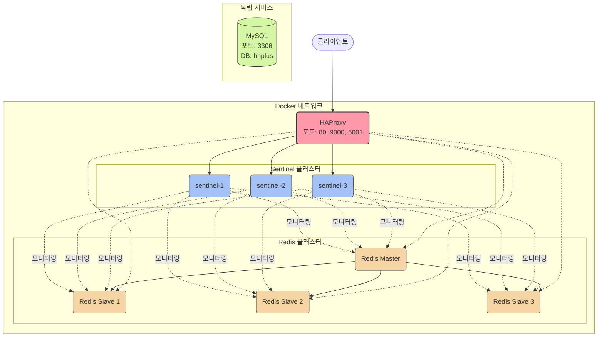

## 항해플러스 - 이커머스 프로젝트

### 설계 문서
1. [요구사항 분석](/docs/1.intro.md)
2. [시퀀스 다이어그램](/docs/2.SequenceDiagram.md)
3. [상태 다이어그램](/docs/4.classDiagram.md)
4. [ERD 문서](/docs/3.erd.md)


### 인프라 구성

1. Docker 실행 
```shell
   docker-compose -f docker-compose.yml up -d
```
2. Redis Sentinel, HAProxy, MySQL
3. HAProxy는 Redis Sentinel을 통해 Redis Master/Slave를 모니터링합니다. (http://localhost/haproxy_stats)
4. HaProxy는 Redis Master/Slave에 대한 요청을 라우팅합니다.

