# ⚓️항해플러스 - 이커머스 프로젝트

## 📚 설계 문서
1. [요구사항 분석](/docs/1.intro.md)
2. [시퀀스 다이어그램](/docs/2.SequenceDiagram.md)
3. [상태 다이어그램](/docs/4.classDiagram.md)
4. [ERD 문서](/docs/3.erd.md)

## 🎮 기술 보고서
- [동시성 보고서](/docs/6.동시성_보고서.md)
- [분산락](/docs/7.분산락.md)
- [Redis]()
  - [캐시 전략 설계](/docs/8.캐시.md)
  - [선착순 쿠폰](/docs/10.선착순%20쿠폰.md)
  - [Redis 랭킹 시스템 보고서](/docs/9.Ranking%20System.md)

- [MSA](/docs/11.Msa.md)
- [Kafka](/docs/12.Kafka.md)


## 🏷️ [선착순 쿠폰 부하 테스트](/docs/13.장애대응.md) 

### 선착순 쿠폰 Spike 트래픽 패턴 모델링

```text
요청률
(req/s)
   300 |        ┌────┐
       |       /     \
       |      /       \
   100 |     /         \
       |    /           \
    70 |   /             ┌─┐
       |  /               \ \
    25 |_/                 \ ┌──┐
       |                    \│   \
     8 |                     └─   ┌──┐
       |                         \│   \
     1 |──────┐                   └─   \
       |      │                        \
     0 +──────┴─────────────────────────└──> 시간
         30s  5s   1분    30s   1분    2분  10s
```


### 인프라 구성

```mermaid
flowchart TB
    client([클라이언트]) --> haproxy
    client --> spring_app
    
    subgraph redis_network[Redis 네트워크]
        haproxy(HAProxy\n포트: 80, 9000, 5001) --> sentinel1
        haproxy --> sentinel2
        haproxy --> sentinel3
        
        subgraph sentinel_cluster[Sentinel 클러스터]
            sentinel1(sentinel-1\n모니터링 & 장애감지)
            sentinel2(sentinel-2\n모니터링 & 장애감지)
            sentinel3(sentinel-3\n모니터링 & 장애감지)
        end
        
        sentinel1 -.모니터링.-> master
        sentinel2 -.모니터링.-> master
        sentinel3 -.모니터링.-> master
        
        sentinel1 -.모니터링.-> slave1
        sentinel1 -.모니터링.-> slave2
        sentinel1 -.모니터링.-> slave3
        
        sentinel2 -.모니터링.-> slave1
        sentinel2 -.모니터링.-> slave2
        sentinel2 -.모니터링.-> slave3
        
        sentinel3 -.모니터링.-> slave1
        sentinel3 -.모니터링.-> slave2
        sentinel3 -.모니터링.-> slave3
        
        subgraph redis_cluster[Redis 클러스터]
            master(Redis Master\n읽기/쓰기) --> slave1(Redis Slave 1\n읽기 전용)
            master --> slave2(Redis Slave 2\n읽기 전용)
            master --> slave3(Redis Slave 3\n읽기 전용)
        end
    end
    
    subgraph kafka_network[Kafka 네트워크]
        subgraph kafka_management[관리 도구]
            kafka_ui(Kafka UI\n포트: 8081)
            redpanda(Redpanda Console\n포트: 8989)
        end
        
        subgraph kafka_coordination[조정 계층]
            zookeeper(Zookeeper\n포트: 2181\n클러스터 조정)
        end
        
        subgraph kafka_cluster[Kafka 브로커 클러스터]
            kafka1(Kafka Broker 1\nID: 1, 포트: 9092)
            kafka2(Kafka Broker 2\nID: 2, 포트: 9093)
            kafka3(Kafka Broker 3\nID: 3, 포트: 9094)
        end
        
        zookeeper -.조정.-> kafka1
        zookeeper -.조정.-> kafka2
        zookeeper -.조정.-> kafka3
        
        kafka1 -.리플리케이션.-> kafka2
        kafka2 -.리플리케이션.-> kafka3
        kafka3 -.리플리케이션.-> kafka1
        
        kafka_ui --> kafka1
        kafka_ui --> kafka2
        kafka_ui --> kafka3
        
        redpanda --> kafka1
        redpanda --> kafka2
        redpanda --> kafka3
    end
    
    subgraph app_network[애플리케이션 네트워크]
        spring_app(Spring Boot\n포트: 8080)
    end
    
    subgraph database[데이터베이스]
        mysql[(MySQL\n포트: 3306\nDB: hhplus)]
    end
    
    %% Spring Boot 연결
    spring_app -.캐시.-> sentinel1
    spring_app -.캐시.-> sentinel2  
    spring_app -.캐시.-> sentinel3
    spring_app -.메시징.-> kafka1
    spring_app -.메시징.-> kafka2
    spring_app -.메시징.-> kafka3
    spring_app -.DB.-> mysql
    
    %% HAProxy 연결
    haproxy -.로드밸런싱.-> master
    haproxy -.로드밸런싱.-> slave1
    haproxy -.로드밸런싱.-> slave2
    haproxy -.로드밸런싱.-> slave3
    
    classDef proxy fill:#ff9999,stroke:#333,stroke-width:2px
    classDef redis fill:#ffcc99,stroke:#333,stroke-width:1px
    classDef sentinel fill:#99ccff,stroke:#333,stroke-width:1px
    classDef kafka fill:#99ff99,stroke:#333,stroke-width:1px
    classDef zk fill:#ffff99,stroke:#333,stroke-width:1px
    classDef app fill:#cc99ff,stroke:#333,stroke-width:2px
    classDef db fill:#99ffcc,stroke:#333,stroke-width:1px
    classDef mgmt fill:#ffccff,stroke:#333,stroke-width:1px
    
    class haproxy proxy
    class master,slave1,slave2,slave3 redis
    class sentinel1,sentinel2,sentinel3 sentinel
    class kafka1,kafka2,kafka3 kafka
    class zookeeper zk
    class spring_app app
    class mysql db
    class kafka_ui,redpanda mgmt
```

