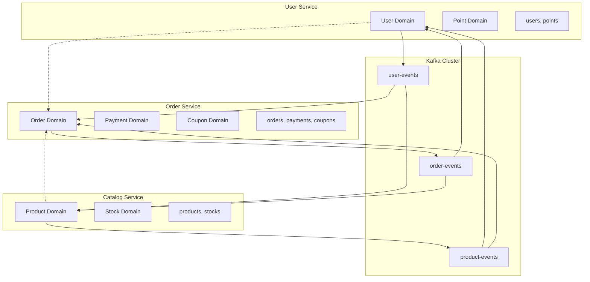
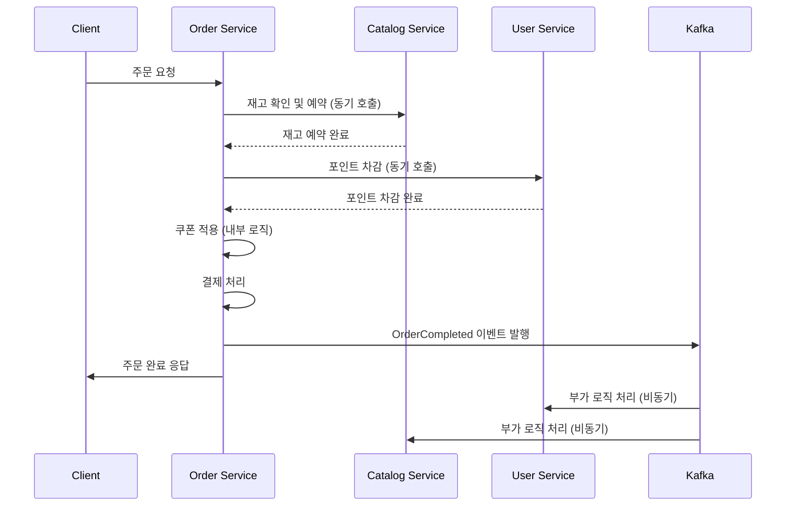
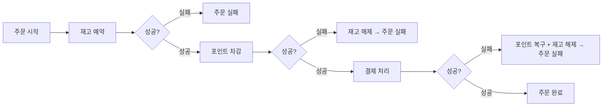

## E-commerce 플랫폼의 마이크로서비스 아키텍처 설계

---

## 1. 도메인 분리 전략

### 배포 단위 결정

현재 프로젝트의 도메인 분석 결과, 기존 MSA 가이드의 3개 서비스 구조를 기반으로 하되, 각 서비스의 책임 범위를 현실적으로 조정한다.

| 서비스                 | 포함 도메인                   | 핵심 책임               | 분리 근거            |
| ------------------- | ------------------------ | ------------------- | ---------------- |
| **User Service**    | User + Point             | 사용자 관리, 포인트 충전/사용   | 독립적인 사용자 라이프사이클  |
| **Catalog Service** | Product + Stock          | 상품 관리, 재고 제어        | 상품-재고 강결합, 조회 중심 |
| **Order Service**   | Order + Payment + Coupon | 주문 생성, 결제 처리, 쿠폰 적용 | 주문 플로우의 복합적 처리   |

### 분리 결정 근거

**User Service 독립 분리:**

- 사용자 도메인은 다른 도메인과 독립적인 라이프사이클을 가짐
- 포인트 충전/사용은 사용자 중심의 비즈니스 로직
- 회원 관리와 인증은 전체 시스템의 기반 서비스

**Catalog Service (Product + Stock):**

- 상품과 재고는 밀접하게 연관된 도메인
- 재고 변경 시 상품 정보도 함께 업데이트되는 경우가 많음
- 조회 중심의 워크로드로 캐싱 전략 통일 가능

**Order Service에 Payment와 Coupon 포함:**

- **Payment 포함 근거**: 주문과 결제는 하나의 비즈니스 플로우
- **Coupon 포함 근거**: 멘토링에서 논의된 "쿠폰 실패가 결제 실패로 이어져야 하는가?" 문제를 Order Service 내부에서 비즈니스 로직으로 처리

### 서비스 아키텍처



---

## 2. 이벤트 설계 원칙

### Kafka Topic 설계

| Topic              | 용도          | 이벤트 예시                                       |
| ------------------ | ----------- | -------------------------------------------- |
| **user-events**    | 사용자/포인트 관련  | UserCreated, PointCharged, PointUsed         |
| **product-events** | 상품/재고 관련    | StockReserved, StockReleased, ProductUpdated |
| **order-events**   | 주문/결제/쿠폰 관련 | OrderCreated, PaymentCompleted, CouponUsed   |

### 이벤트 데이터 설계

멘토링 피드백을 반영하여 이벤트에는 **최소한의 식별자만 포함**하고, 각 서비스에서 필요시 조회하는 방식을 채택한다.

```json
// 주문 완료 이벤트
{
  "eventType": "OrderCompleted",
  "orderId": "12345",
  "userId": "67890",
  "productId": "11111",
  "requestId": "abc-123",
  "timestamp": "2024-01-01T10:00:00Z"
}
```

**이벤트 설계 이유:**

- Order 전체 객체 전달 시 불필요한 데이터 포함
- JPA 영속성 컨텍스트 문제로 인한 stale 데이터 위험
- 각 서비스에서 필요한 데이터만 조회하여 fresh한 데이터 보장

---

## 3. 핵심 로직과 부가 로직 구분

### 멘토링 기반 구분 기준

**핵심 로직**: 실패 시 전체 트랜잭션이 실패해야 하는 로직 **부가 로직**: 실패해도 전체 트랜잭션에 영향을 주지 않는 로직

### 주문 플로우의 로직 분류

| 처리 단계      | 로직 분류       | 실패 시 영향 | 처리 방식               |
| ---------- | ----------- | ------- | ------------------- |
| 재고 확인 및 예약 | 핵심          | 전체 실패   | 동기 처리               |
| 사용자 포인트 차감 | 핵심          | 전체 실패   | 동기 처리               |
| 결제 처리      | 핵심          | 전체 실패   | 동기 처리               |
| 쿠폰 적용      | **비즈니스 판단** | 설정 가능   | Order Service 내부 로직 |
| 데이터 플랫폼 전송 | 부가          | 무관      | 비동기 이벤트             |
| 푸시 알림      | 부가          | 무관      | 비동기 이벤트             |

### 쿠폰 로직의 특별 처리

멘토링에서 논의된 "쿠폰 사용 실패가 결제 실패로 이어져야 하는가?" 문제를 Order Service 내부 비즈니스 로직으로 처리한다.

```
Order Service 내부 처리 로직:
1. 쿠폰 유효성 검사
2. 실패 시 비즈니스 규칙에 따라 처리
   - 필수 쿠폰: 전체 주문 실패
   - 선택 쿠폰: 쿠폰 없이 주문 진행
```

---

## 4. 분산 트랜잭션 처리

### 주문 처리 플로우



### 보상 트랜잭션 처리

멘토링 피드백을 반영하여 **리스너 내부 예외 처리 방식**을 채택한다.

### 실패 시나리오별 보상 전략

|실패 지점|보상 액션|실행 주체|구현 방식|
|---|---|---|---|
|재고 예약 실패|-|-|즉시 실패 응답|
|포인트 차감 실패|재고 해제|Order Service|동기 API 호출|
|결제 실패|포인트 복구 + 재고 해제|Order Service|동기 API 호출|



---

## 5. 데이터 정합성 보장

### 일관성 전략

|데이터 유형|일관성 수준|구현 방식|적용 사례|
|---|---|---|---|
|주문-재고|Strong|동기 API 호출|재고 예약/해제|
|주문-포인트|Strong|동기 API 호출|포인트 차감/복구|
|주문-쿠폰|Strong|같은 서비스 내 처리|Order Service 내부|
|통계-분석|Eventual|이벤트 기반|데이터 플랫폼 전송|

### API vs 이벤트 선택 기준

**동기 API 호출 사용:**

- 즉시 응답이 필요한 경우
- 실패 시 전체 롤백이 필요한 경우
- 사용자 요청 처리 중 필수 로직

**비동기 이벤트 사용:**

- 부가 로직 처리
- 다른 서비스에 대한 알림
- 통계 및 분석 데이터 처리

---

## 6. 분리에 따른 장단점 분석

### 장점

**개발 효율성:**

- 3개 서비스로 관리 복잡도 적절함
- 각 팀의 책임 영역 명확
- 독립적 배포와 확장 가능

**비즈니스 로직 집중:**

- Order Service에서 주문 플로우 전체 관리
- 복잡한 비즈니스 규칙을 하나의 서비스에서 처리

### 단점

**Order Service의 복잡성:**

- 여러 도메인을 포함하여 복잡도 증가
- 향후 분리 필요성 대두 가능성

**서비스 간 결합도:**

- 동기 API 호출로 인한 결합도 존재
- 한 서비스 장애가 다른 서비스에 영향

**확장성 제약:**

- Order Service가 병목 지점이 될 가능성
- 쿠폰 도메인의 독립적 확장 어려움

---

## 7. 트랜잭션 처리의 한계와 해결방안

### 물리적 트랜잭션의 한계

MSA 환경에서는 데이터베이스가 분리되어 ACID 트랜잭션을 사용할 수 없다. 따라서 분산 환경에서의 데이터 정합성 보장이 핵심 과제가 된다.

### 현실적 해결방안

**1. 핵심 로직은 동기 처리**

- 재고 예약, 포인트 차감 등은 동기 API 호출
- 실패 시 즉시 보상 로직 실행
- 2PC보다 단순하지만 효과적인 방식

**2. 부가 로직은 비동기 처리**

- 데이터 플랫폼 전송, 알림 등은 이벤트 기반
- 실패해도 전체 플로우에 영향 없음
- Eventually Consistent 허용

**3. 보상 트랜잭션 단순화**

- 멘토링 피드백에 따라 연쇄 이벤트 최소화
- 리스너 내부 try-catch로 보상 처리
- 대응 함수 쌍 구현 (increment/decrement)

---

## 결론

현재 프로젝트에서는 User, Catalog, Order 3개 서비스로 분리하되, 각 서비스의 책임 범위를 현실적으로 조정하는 것이 적절하다.

**핵심 설계 원칙:**

- 실패 시 전체 실패 여부를 기준으로 핵심/부가 로직 구분
- 핵심 로직은 동기 처리, 부가 로직은 비동기 처리
- 보상 트랜잭션은 단순하게 설계하여 복잡도 최소화
