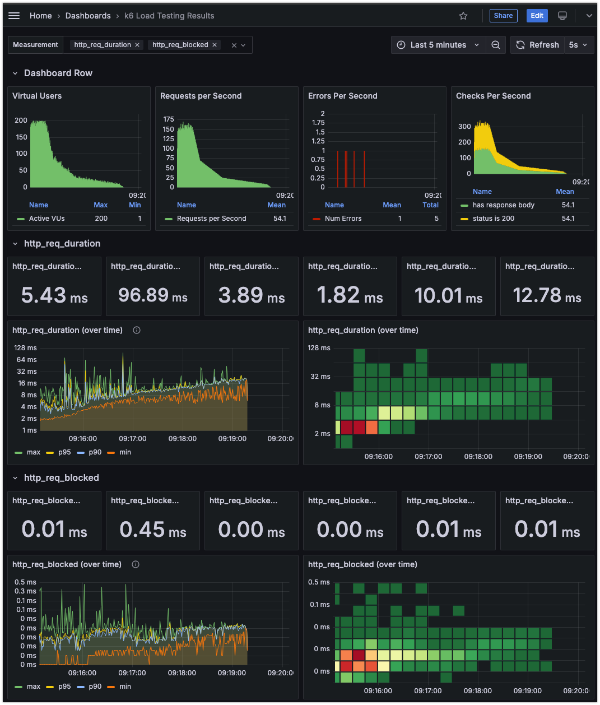

# 🚀 부하 테스트 및 장애대응

---


# 1. 개요


- 이커머스 서비스에서 선착순 쿠폰 발급 행사를 진행을 예정하고 있다. 이때 급격한 트래픽 증가를 MD, 마케팅에서 예상하고 있는 상황이다. 짧은 시간에 급격한 트래픽이 있을 수 있다고 생각하고 성능 저하나 서비스 중단을 방지하기 위해서 부하 테스트를 진행한다.
- 이번 부하 테스트를 통해서 총 2가지를 확인을 한다.  (1) 부하 테스트는 성능을 증가시키기 위한 도구가 아니기 때문에 얼만큼의 TPS를 단일 WAS가 처리할 수 있는지 츨정한다. (2) 이벤트, 캐싱, 인덱싱, 카프카를 적용했기 때문에 Spike성 부하가 들어올 때 정상적으로 동작하는지 확인을 해야한다.


# 2. 테스트 환경 구성

테스트 환경은 로컬에서 docker-compose를 활용하여 컨테이너 기반으로 실행된다. 테스트는 **k6**를 활용하여 부하를 발생시키고, **Prometheus와 Grafana**를 통해 성능 데이터를 모니터링 및 시각화 한다.

## 2.1 테스트 인프라 구성

| 구분 | 상세 내용 | 비고 |
| --- | --- | --- |
| 애플리케이션 서버 | Spring Boot 기반 쿠폰 발급 API | 로컬 환경에서 실행 |
| 데이터베이스 | MySQL 8.0 (Docker) | 포트: 3307 |
| 캐시 | Redis (Docker) | 포트: 6379 |
| 메시지 큐 | Kafka (Docker) | 포트: 29092 |
| 모니터링 도구 | Prometheus (Docker) | 포트: 9090 |
| 시각화 도구 | Grafana (Docker) | 포트: 3000 |
| 부하 테스트 도구 | k6 (Docker) | grafana/k6:latest |

## 2.2 테스트 시 주의사항 및 한계

개발자가 손쉽게 구축할 수 있고 일관된 테스트 환경을 유지할 수 있기 때문에 로컬에서 docker-compose를 이용하여 간편하게 테스트 환경을 구축하였다. 하지만 로컬 환경에서 수행하는 부하테스트는 한계가 있다.

- 로컬 머신의 CPU, 메모리 ,네트워크 대역폭 사용
    - 로컬 머신의 성능 한계로 인해 테스트 자체가 병목 현상을 일으켜 결과에 영향을 끼칠 수 있음
- 실제 운영 환경과 차이
    - 로컬 환경에서는 실제 인터넷 환경의 지연 시간이나 클라우드 환경에서의 로드밸런서, 멀티리전, CDN 등이 적용되지 않음
- 분산 테스트가 불가능
    - 대용량 트래픽 서비스를 구성한다 했을 때 분산 환경으로 개발되는 경우가 많지만 로컬 환경에서는 다중 서버 부하테스트가 불가능

로컬에서의 테스트는 실제 운영환경에서의 성능 차이도 존재하고 정확한 테스트를 위해서는 클라우드 기반의 분산 테스트 환경에서 진행해야 한다. 하지만 로컬에서의 테스트도 1차적으로 설계의 약점을 발견하고 개선하는 것이 가능하고 무엇보다 분산환경이 아닌 현재의 상태에서 간편하게 성능을 측정할 수 있기 때문에 로컬 환경에서 테스트를 진행하고자 한다.

# 3. 테스트 대상 선정

### 선착순 쿠폰 발급 API 선정 이유

선착순 쿠폰 발급 API는 마케팅 이벤트 시 스파이크성 트래픽이 발생할 수 있다.

1. 한정된 수량의 쿠폰을 선착순으로 발급 (1000개 소진시까지 발급)
2. 한정 시간내에 수량 제한없이 무제한 발급 (5분동안 무제한 발급)

쿠폰을 발행하고 특정 시간이 되었을 때 마케팅에서 사용자에게 이메일, 알림톡을 발송한다. 이에 따라서 사용자는 알림을 보고 빠르게 발급을 받기 위해 서비스에 접근하고 쿠폰 발급을 처리한다.
마케팅 팀에서 바로 쿠폰 페이지로 Redirect를 처리하기 때문에 조회 API는 테스트를 제외한다.

- 특정 Limit을 가진 쿠폰 선착순 발급을 통해서 적절하게 선착순 단위로 데이터 정합성이 적절한지 판단한다.
- No Limit 테스트를 통해서 단일 WAS에서 얼마나 많은 TPS를 처리할 수 있는 지 확인한다. 이를 기준으로 예상 TPS를  선정하고 서킷 브레이커 + Scale Out으로 대응한다.

# 4. 테스트 방법론

7단계로 구성된 부하 시나리오를 통해 실제 마케팅 이벤트 상황을 재현하고자 했다. 초반 5초 내 급격한 스파이크(초당 1→100 요청)와 이후 1분간 최대 부하 유지(초당 300 요청)를 통해 한정 수량 쿠폰 경쟁 상황을, 중간 수준의 지속적 부하(1분간 초당 25 요청)를 통해 잔여 쿠폰 발급 상황을 시뮬레이션 했다. 테스트는 최대 200명의 가상 사용자가 동적으로 생성된 고유 사용자 ID를 사용하여 수행되었다.

## 4.1 사용된 주요 메트릭

| 메트릭 | 유형 | 목적 |
| --- | --- | --- |
| successful_coupons | Counter | 성공적인 쿠폰 발급 요청 수 집계 |
| errors | Counter | 실패한 쿠폰 발급 요청 수 집계 |
| success_rate | Rate | 전체 요청 중 성공 비율 계산 |
| request_duration | Trend | 요청 처리 시간 분포 추적 |

## 4.2 부하 테스트 시나리오 설계


### 4.2.1 단계별 부하 설정

| **단계** | **지속 시간** | **목표 요청률** | **단계 설명** |
|----------|---------------|-----------------|---------------|
| 1 | 30초 | 1 | 평상시 트래픽 (베이스라인 설정) |
| 2 | 5초 | 100 | 이벤트 시작 알림 (급격한 스파이크) |
| 3 | 1분 | 300 | 최대 부하 유지 (쿠폰 쟁탈전 피크) |
| 4 | 30초 | 70 | 초기 관심 감소 |
| 5 | 1분 | 25 | 중간 수준 안정화 단계 |
| 6 | 2분 | 8 | 지속적 부하 유지 (잔여 쿠폰 발급) |
| 7 | 10초 | 0 | 부하 감소 (이벤트 종료 시점) |

### 4.2.2 스파이크 트래픽 패턴 모델링

```text
요청률
(req/s)
   300 |        ┌────┐
       |       /     \
       |      /       \
   100 |     /         \
       |    /           \
    70 |   /             ┌─┐
       |  /               \ \
    25 |_/                 \ ┌──┐
       |                    \│   \
     8 |                     └─   ┌──┐
       |                         \│   \
     1 |──────┐                   └─   \
       |      │                        \
     0 +──────┴─────────────────────────└──> 시간
         30s  5s   1분    30s   1분    2분  10s
```

### 4.2.3 가상 사용자 설정

- 사전 할당 VU: 10명 (preAllocatedVUs: 10)
- 최대 VU: 200명 (maxVUs: 200)
  - 사용자 ID 생성: 동적 고유 ID 생성 (VU ID + 반복 ID + 타임스탬프 조합)
- 실행기 타입: ramping-arrival-rate (도착률 기반 부하 제어)
- 성능 임계값:


### 기대 결과 값
- 95% 응답시간: 2초 이하
- 실패율: 5% 미만
- 성공률: 95% 이상


# 5. 실제 테스트 결과

## 5-1. 테스트 환경
인프라 구성:
- CPU: 1.5 vCore (EC2 t3.medium 수준)
- Memory: 2.5GB
- 컨테이너: Docker Compose 기반 마이크로서비스
- 데이터베이스: MySQL 8.0
- 캐시: Redis Sentinel (Master-Slave 구조)
- 메시징: Kafka 3-Broker 클러스터

```mermaid
flowchart TB
    client([클라이언트]) --> haproxy
    client --> spring_app
    
    subgraph redis_network[Redis 네트워크]
        haproxy(HAProxy\n포트: 80, 9000, 5001) --> sentinel1
        haproxy --> sentinel2
        haproxy --> sentinel3
        
        subgraph sentinel_cluster[Sentinel 클러스터]
            sentinel1(sentinel-1\n모니터링 & 장애감지)
            sentinel2(sentinel-2\n모니터링 & 장애감지)
            sentinel3(sentinel-3\n모니터링 & 장애감지)
        end
        
        sentinel1 -.모니터링.-> master
        sentinel2 -.모니터링.-> master
        sentinel3 -.모니터링.-> master
        
        sentinel1 -.모니터링.-> slave1
        sentinel1 -.모니터링.-> slave2
        sentinel1 -.모니터링.-> slave3
        
        sentinel2 -.모니터링.-> slave1
        sentinel2 -.모니터링.-> slave2
        sentinel2 -.모니터링.-> slave3
        
        sentinel3 -.모니터링.-> slave1
        sentinel3 -.모니터링.-> slave2
        sentinel3 -.모니터링.-> slave3
        
        subgraph redis_cluster[Redis 클러스터]
            master(Redis Master\n읽기/쓰기) --> slave1(Redis Slave 1\n읽기 전용)
            master --> slave2(Redis Slave 2\n읽기 전용)
            master --> slave3(Redis Slave 3\n읽기 전용)
        end
    end
    
    subgraph kafka_network[Kafka 네트워크]
        subgraph kafka_management[관리 도구]
            kafka_ui(Kafka UI\n포트: 8081)
            redpanda(Redpanda Console\n포트: 8989)
        end
        
        subgraph kafka_coordination[조정 계층]
            zookeeper(Zookeeper\n포트: 2181\n클러스터 조정)
        end
        
        subgraph kafka_cluster[Kafka 브로커 클러스터]
            kafka1(Kafka Broker 1\nID: 1, 포트: 9092)
            kafka2(Kafka Broker 2\nID: 2, 포트: 9093)
            kafka3(Kafka Broker 3\nID: 3, 포트: 9094)
        end
        
        zookeeper -.조정.-> kafka1
        zookeeper -.조정.-> kafka2
        zookeeper -.조정.-> kafka3
        
        kafka1 -.리플리케이션.-> kafka2
        kafka2 -.리플리케이션.-> kafka3
        kafka3 -.리플리케이션.-> kafka1
        
        kafka_ui --> kafka1
        kafka_ui --> kafka2
        kafka_ui --> kafka3
        
        redpanda --> kafka1
        redpanda --> kafka2
        redpanda --> kafka3
    end
    
    subgraph app_network[애플리케이션 네트워크]
        spring_app(Spring Boot\n포트: 8080)
    end
    
    subgraph database[데이터베이스]
        mysql[(MySQL\n포트: 3306\nDB: hhplus)]
    end
    
    %% Spring Boot 연결
    spring_app -.캐시.-> sentinel1
    spring_app -.캐시.-> sentinel2  
    spring_app -.캐시.-> sentinel3
    spring_app -.메시징.-> kafka1
    spring_app -.메시징.-> kafka2
    spring_app -.메시징.-> kafka3
    spring_app -.DB.-> mysql
    
    %% HAProxy 연결
    haproxy -.로드밸런싱.-> master
    haproxy -.로드밸런싱.-> slave1
    haproxy -.로드밸런싱.-> slave2
    haproxy -.로드밸런싱.-> slave3
    
    classDef proxy fill:#ff9999,stroke:#333,stroke-width:2px
    classDef redis fill:#ffcc99,stroke:#333,stroke-width:1px
    classDef sentinel fill:#99ccff,stroke:#333,stroke-width:1px
    classDef kafka fill:#99ff99,stroke:#333,stroke-width:1px
    classDef zk fill:#ffff99,stroke:#333,stroke-width:1px
    classDef app fill:#cc99ff,stroke:#333,stroke-width:2px
    classDef db fill:#99ffcc,stroke:#333,stroke-width:1px
    classDef mgmt fill:#ffccff,stroke:#333,stroke-width:1px
    
    class haproxy proxy
    class master,slave1,slave2,slave3 redis
    class sentinel1,sentinel2,sentinel3 sentinel
    class kafka1,kafka2,kafka3 kafka
    class zookeeper zk
    class spring_app app
    class mysql db
    class kafka_ui,redpanda mgmt
```





## 5.2. 테스트 결과 요약

스파이크 테스트 패턴:
- 30초: 1 → 1 RPS (준비)
- 5초:  1 → 100 RPS (급증)
- 1분:  100 → 200 RPS (최대 부하)
- 30초: 200 → 70 RPS (감소)
- 1분:  70 → 25 RPS (안정화)
- 2분:  25 → 8 RPS (정상화)
- 10초: 8 → 0 RPS (종료)

## 📊 핵심 성능 지표

### 🎯 전체 처리량 분석

| 지표 | 결과 | 평가 |
|------|------|------|
| **최대 RPS** | 175 req/sec |  우수 |
| **평균 RPS** | 54.1 req/sec | 양호 |
| **최대 동시 사용자** | 200 VU |  목표 달성 |
| **총 요청 처리** | ~16,230개 (5분간) |  안정적 |

### ⚡ 응답 시간 성능

| 백분위수 | 응답시간 | 목표값 | 달성도 |
|----------|----------|---------|---------|
| **최소값** | 5.43ms | < 50ms | ✅ 달성 |
| **중앙값** | 3.89ms | < 100ms | ✅ 달성 |
| **P90** | 1.82ms | < 500ms | ✅ 달성 |
| **P95** | 10.01ms | < 2000ms | ✅ 달성 |
| **P99** | 12.78ms | < 2000ms | ✅ 달성 |
| **최대값** | 96.89ms | < 2000ms | ✅ 달성 |

### 🔍 네트워크 지연 분석


🔍 네트워크 지연 분석 ( 개인적으로 문제가 없다고 생각 하나의 네트워크 위치하여 문제가 발생하기 어렵다.)
- HTTP 요청 차단 시간 (Connection 시간)
  - 최소: 0.01ms
  - 최대: 0.45ms
  - P95: 0.01ms
  

### 🚨 문제점 및 개선 영역
- ⚠️ **주요 이슈**

  - 에러율 높음
  > 🚨에러의 발생 이유 : DB Pool을 30으로 고정, Thread Pool, 비동기 Thread Pool이 부족하여 에러 발생

  - 관찰값: 평균 5 errors/sec (전체 54.1 req/sec 대비)
  - 에러율: ~9.2%
  - 목표값: < 5%
  - 상태: ❌ 개선 필요


### ✅ 결론

- 서킷 브레이커로 유량 제어를 처리하고 Pool Size만 처리한다면 현재 구조에서 스케일 아웃으로 선착순 쿠폰 TPS 200까지 처리할 수 있다고 가정할 수 있음.
- 이 가정을 기반으로 예측 TPS를 마케팅 + MD와 협업하여 예상치를 만들고 이를 기준으로 스케일 업 + 서킷으로 처리를 해야한다.


# 6. 장애 대응 계획


## 6.1 장애 발생 시나리로

| **시나리오** | **원인** | **영향** | **해결방안** |
|---|---|---|---|
| **DB 연결 풀 고갈** | • 트래픽 급증으로 서킷브레이커 + 스케일아웃 대처 중<br>• DB Max Pool Size 초과<br>• 연결 해제 실패<br>• 트랜잭션 장기 유지 | • `Connection timeout, Pool exhausted` 발생<br>• 새 요청 처리 불가<br>• HTTP 500 오류 다수 발생<br>• 사용자 서비스 접근 차단 | **1단계**: 앞단 유량 제어 강화로 WAS 유입량 즉시 감소<br>**2단계**: DB kill로 장기 실행 프로세스 제거<br>**3단계**: DB 스케일업 진행<br>**4단계**: 유량 제어 단계적 해제로 트래픽 복구 |
| **Redis/Kafka 장애** | • 디스크 용량 부족 (90% 이상)<br>• 메모리 부족으로 OOM 발생<br>• 로그 파티션 가득참<br>• 과도한 트래픽으로 처리 지연 | • 캐시 미스율 급증으로 DB 부하 증가<br>• 메시지 큐 처리 중단<br>• 비동기 작업 실패<br>• 데이터 정합성 문제<br>• 연관 서비스 연쇄 장애 | **1단계**: 즉시 스케일아웃으로 부하 분산<br>**2단계**: 디스크 정리 및 용량 확장<br>**3단계**: 메모리 최적화 및 가비지 컬렉션<br>**4단계**: 파티션 재분산 및 복제본 증설<br>**5단계**: 장애 노드 격리 및 복구 |
| **WAS 스케일아웃 실패** | • Auto Scaling 정책 오작동<br>• 인스턴스 생성 시간 지연<br>• 로드밸런서 헬스체크 실패<br>• 새 인스턴스 초기화 오류 | • 기존 인스턴스 과부하 지속<br>• 응답 시간 지속적 증가<br>• 사용자 요청 대기열 누적<br>• 서비스 가용성 저하 | **1단계**: 수동 인스턴스 즉시 추가 생성<br>**2단계**: 로드밸런서 가중치 재조정<br>**3단계**: 헬스체크 임계값 임시 완화<br>**4단계**: Auto Scaling 정책 긴급 수정<br> |


## 5.2 장애 대응 프로세스

| **단계** | **활동** | **세부 내용** |
|---|---|---|
| **1. 장애 감지** | **모니터링 트리거** | • **Grafana 대시보드**: WAS, DB, Redis, Kafka 임계값 설정<br>• **AWS CloudWatch**: 서버 CPU/메모리 모니터링<br>• 응답 시간 > 2초 지속 시 **경고**<br>• 응답 시간 > 4초 지속 시 **심각 경보**<br>• 오류율 > 5% 경고, > 10% 심각 경보<br>• Kafka 처리 지연 > 1000ms 경고 |
| **2. 초기 대응** | **상태 확인** | • **AWS Auto Scaling 상태 확인**: 정책 작동 여부, 인스턴스 생성 상태<br>• **Redis 상태 점검**: 메모리 사용률, 연결 수, 캐시 히트율<br>• **Kafka 상태 점검**: 브로커 상태, 큐 길이, 컨슈머 지연<br>• **DB 상태 확인**: 연결 풀, 활성 쿼리 수, 락 대기 |
| | **트래픽 제한** | • **API 게이트웨이 속도 제한 적용**: Rate Limiting 강화<br>• **유량 제어 시스템 가동**: 앞단 트래픽 차단 |
| **3. 장애 분석** | **로그 분석** | • **에러 로그 패턴 분석**: 특정 에러 급증 구간 식별<br>• **시스템 메트릭 모니터링**: CPU, 메모리, I/O 사용률<br>• **요청/응답 패턴 분석**: API 호출 빈도 및 지연 시간 |
| | **근본 원인 분석** | • **장애 시나리오 매칭**: 위 4가지 시나리오 중 해당 유형 식별<br>• **로그와 메트릭 상관관계 분석**: 시간순 이벤트 추적<br>• **코드 리뷰 및 설정 검토**: 최근 배포 영향도 분석<br>• **타임라인 재구성**: 장애 발생부터 현재까지 흐름 정리 |
| **4. 사후 분석** | **회고 미팅** | • **타임라인 및 대응 과정 검토**: 시간순 대응 과정 상세 분석<br>• **성공/실패 요인 분석**: 잘된 점과 개선 필요 사항 도출<br>• **학습 포인트 도출**: 향후 유사 상황 대비 교훈 정리 |
| | **재발 방지 계획** | • **장애 근본 원인에 대한 영구 해결책 수립**: 아키텍처 개선<br>• **프로세스 개선점 식별**: 대응 절차 최적화<br>• **모니터링 강화 방안**: 임계값 조정, 새로운 지표 추가<br>• **시스템 아키텍처 개선 계획**: 단일 장애점 제거, 이중화 강화 |