# ERD

---

```mermaid
erDiagram
    OrderEntity ||--o{ OrderItemEntity : "contains"
    OrderEntity }|--|| User : "placed by"
    OrderEntity ||--o{ PaymentEntity : "has"
    OrderEntity ||--o| UserCouponEntity : "uses"
    
    User ||--o{ UserCouponEntity : "owns"
    User ||--o{ PaymentEntity : "makes"
    
    Product ||--o{ OrderItemEntity : "included in"
    Product ||--|| Stock : "has"
    
    coupon ||--o{ UserCouponEntity : "assigned to"
    
    OrderEntity {
        Long id
        String dataPath
        BigDecimal discountAmount
        LocalDateTime expireTime
        BigDecimal finalAmount
        OrderStatus status
        BigDecimal totalTax
        BigDecimal totalPrice
        Long userCouponId
        Long userId
    }
    
    OrderItemEntity {
        Long id
        Long ea
        String skuId
        Long unitPrice
    }
    
    User {
        Long id
        Long version
    }
    
    UserCouponEntity {
        Long id
        Long couponId
        CouponStatus couponStatus
        Long orderId
        Long userId
    }
    
    Product {
        Long id
        CategoryEnum category
        String productName
        String skuId
        Long unitPrice
    }
    
    PaymentEntity {
        Long id
        BigDecimal amount
        Long orderId
        PaymentStatus status
        Long userId
    }
    
    Stock {
        Long id
        CategoryEnum category
        Long orderId
        String skuId
    }
    
    coupon {
        Long id
        double discountAmount
        CouponDiscountType discountType
        LocalDateTime expireTime
        long initQuantity
        String name
        long remainQuantity
    }
```

### User - Order (1:N)
- 한 사용자가 여러 주문을 생성 가능
- `places` 관계로 표현

### User - UserCoupon (1:N)
- 한 사용자가 여러 쿠폰 보유 가능
- `has` 관계로 표현

### Coupon - UserCoupon (1:N)
- 하나의 쿠폰이 여러 사용자에게 발급 가능
- `belongs_to` 관계로 표현

### Order - OrderItem (1:N)
- 하나의 주문에 여러 상품 포함 가능
- `contains` 관계로 표현

### Product - OrderItem (1:N)
- 하나의 상품이 여러 주문에 포함 가능
- `included_in` 관계로 표현

### Product - Stock (1:1)
- 상품과 재고는 1:1 관계
- `has` 관계로 표현

