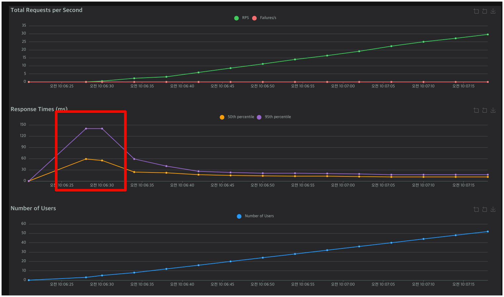

# 캐시

---

## 1. 캐싱의 필요성과 목적

캐싱은 자주 접근하는 데이터를 빠르게 접근 가능한 저장소에 미리 복제해두는 기술로, 다음과 같은 상황에서 시스템 성능을 크게 향상시킬 수 있습니다:

- **높은 조회 빈도**: 초당 수백~수천 건의 반복적인 조회가 발생하는 데이터
- **긴 연산 시간**: 복잡한 쿼리나 여러 마이크로서비스를 걸쳐 조합해야 하는 데이터
- **낮은 변경 빈도**: 읽기 작업이 쓰기 작업보다 현저히 많은 데이터
- **높은 리소스 비용**: DB 조회나 외부 API 호출과 같이 비용이 많이 드는 작업

효과적인 캐싱 전략을 통해 다음과 같은 이점을 얻을 수 있습니다:
- 응답 시간 단축 (사용자 경험 향상)
- 시스템 처리량 증가 (동일 리소스로 더 많은 요청 처리)
- 데이터베이스 부하 감소 (비용 절감 및 안정성 향상)
- 네트워크 트래픽 감소 (대역폭 효율화)

## 2. 캐싱 대상 선정

### 2-1. 상품 목록 조회 - Page 0

**[ 캐싱을 적용한 이유 ]**

- 일반적으로 B2C 형태의 이커머스에서 Filter의 처음 페이지의 상품은 변경이 많지 않고, 자주 조회되는 데이터입니다.
- Page 형식에서 page=0은 cache hit율은 100로 처리된다고 생각하여 page=0에 대해서만 캐싱을 적용하였습니다.

```java
@Slf4j
@Component
@RequiredArgsConstructor
public class CacheKeyManager {
    private final ObjectMapper objectMapper;

    public String generateKey(Object... params) {
        try {
            return objectMapper.writeValueAsString(params);
        } catch (JsonProcessingException e) {
            log.error(e.getMessage(), e);
            return String.valueOf(java.util.Arrays.hashCode(params));
        }
    }

    @Getter
    public enum CacheType {
        PRODUCT("product", Duration.ofDays(1));

        private final String cacheName;
        private final Duration ttl;

        CacheType(String cacheName, Duration ttl) {
            this.cacheName = cacheName;
            this.ttl = ttl;
        }

    }
}
```

```java
    @Cacheable(
            value = "product",
            key = "@cacheKeyManager.generateKey(#page, #size)",
            condition = "#page == 0"
    )
    public ProductInfo.CustomPageImpl<ProductStockDTO> getAllProduct(int page, int size) {
        Pageable pageable = PageRequest.of(page, size);
        Page<ProductStockDTO> originalPage = productRepository.getProductsWithStockInfo(pageable);
        return new ProductInfo.CustomPageImpl<>(originalPage);
    }

    @Cacheable(
            value = "product",
            key = "@cacheKeyManager.generateKey(#categoryCode, #page, #size)",
            condition = "#page == 0"
    )
    public ProductInfo.CustomPageImpl<ProductStockDTO> getProductByCategoryCode(String categoryCode, int page, int size) {
        Pageable pageable = PageRequest.of(page, size);
        Page<ProductStockDTO> originalPage = productRepository.getProductsWithStockInfoByCategory(categoryCode, pageable);
        return new ProductInfo.CustomPageImpl<>(originalPage);
    }
```



- 처음에 캐싱을 적용을 할 때 Peak를 치고 이후에는 낮은 레이턴시를 유지하는 것을 확인할 수 있습니다.

### 2-2. 인기 상품 조회

[ 캐싱을 적용한 이유 ]

- 인기 상품은 자주 조회되는 데이터로, 캐싱을 통해 성능을 향상시킬 수 있습니다. (3일을 기준으로 처리한다.)
- 상품의 재고 및 주문을 Row 기반으로 관리하기 때문에 집계 쿼리를 사용하기 때문에 Row의 수가 많아진다면 DB 연산의 부화를 줄 수 있다.


```java
@Component
@Slf4j
@RequiredArgsConstructor
public class HotProductScheduler {

    private final OrderCoreRepository orderCoreRepository;
    private final ProductRepository productRepository;

    @Scheduled(cron = "0 0 0 */3 * *")
    public void refetchHotProductList() {
        LocalDateTime current = LocalDateTime.now();
        String startDatePath = DatePathProvider.toPath(current.minusDays(3).with(LocalTime.MIN));
        String endDatePath = DatePathProvider.toPath(current.with(LocalTime.MAX));
        List<HotProductQuery> rtn = orderCoreRepository.findHotProducts(startDatePath, endDatePath);
        productRepository.setHotProductsCacheLimit5(rtn);
    }
}

@Repository
@RequiredArgsConstructor
public class ProductCacheRepository {

    private final RedisTemplateRepository redisRepository;
    private static final String HOT_PRODUCT_CACHE_NAME = "hot_product::[]";
    private static final Duration HOT_PRODUCT_CACHE_EXPIRE_TIME = Duration.ofDays(3);
    private static final int HOT_PRODUCT_CACHE_LIMIT = 5;

    public List<HotProductQuery> findHotProductsCacheLimit5(){
        return redisRepository.getTopNFromSortedSet(HOT_PRODUCT_CACHE_NAME, HOT_PRODUCT_CACHE_LIMIT, HotProductQuery.class);
    }

    public void setHotProductsCacheLimit5(List<HotProductQuery> hotProductsCache) {
        redisRepository.delete(HOT_PRODUCT_CACHE_NAME);
        for (int i = 0; i < hotProductsCache.size(); i++) {
            float score = hotProductsCache.size() - i;
            redisRepository.addToSortedSet(HOT_PRODUCT_CACHE_NAME, hotProductsCache.get(i), score);
        }
        redisRepository.expire(HOT_PRODUCT_CACHE_NAME, HOT_PRODUCT_CACHE_EXPIRE_TIME);
    }
}
```

- 스케줄 시점을 기준으로 3일을 기준으로 가장 많이 판매된 제품을 제공합니다. 
- 캐싱을 통해 DB의 부하를 줄이고, Redis에서 직접 조회하여 성능을 향상시킬 수 있습니다.
- TTL을 3일간으로 지정하고 있습니다. 만약에 redis에서 delete하는 과정에서 캐싱이 지워진다면 `productCacheRepository`에서 DB를 조회하여 캐싱을 처리하게 작성하여 Cache Miss의 경우를 대비를 하였습니다.