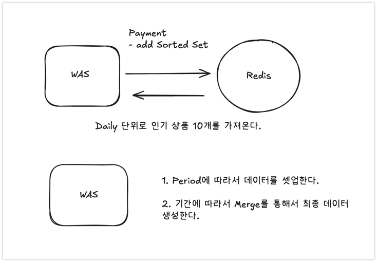

# 랭킹 시스템

---


## 설계

1. Redis를 센티넬 구성으로 설정하여 최소한의 안정성은 확보를 하여 Redis를 NoSQL로 사용한다.
2. 랭킹 시스템은 핵심 비즈니스가 아니라 특정 기간에 한정하여 사용하는 휘발성 데이터라고 정의하여 Redis에 적재를 시킨다.
3. 일별로 랭킹을 생성하여 Redis에 적재한다.
    - 랭킹이 추가 되는 경우는 주문 -> 결제가 성공적으로 처리되면 적재된다.
    - Sorted Set `ZINCRBY`를 통해 적재한다.
4. 날짜를 `Path-like encoding` 방식으로 처리한다.
    - eg )   기준일시 설정 (2025-01-01 00:00:00)  = 00000
    - eg )   기준일시 설정 (2025-05-16 00:00:00)  = 0003q


```redis
# 최종 Redis 예시

redis-cli : product::daily:00001
redis-cli : product::daily:00002
redis-cli : product::daily:00003

```

## 캐싱 대상 선정

### 1. 랭킹 시스템을 정의하자

- 랭킹 시스템은 특정 기간에 한정하여 사용하는 휘발성 데이터라고 정의한다. 이것을 따로 누계 데이터로 관리하는 것은 비효율적라고 생각한다.
- 그래서 Redis에 적재하는게 적절하다고 판단한다. 모든 Range의 데이터를 관리하는 것은 비효율적이라고 판단하여 10일치를 관리하기 위해 TTL을 10일로 설정한다.

```java
@Transactional(readOnly = true)
public Ranking getHotProducts(String rankingPeriod, int getTopNumber) {
    RankingPeriod period = RankingPeriod.matching(rankingPeriod);
    String targetPath = DatePathProvider.toPath(LocalDateTime.now());

    return switch (period) {
        case DAILY -> productRepository.findDailyByPeriod(targetPath)
                .getTopN(getTopNumber);
        case THREE_DAYS -> findMergeDaysRanking(targetPath, 3, period)
                .getTopN(getTopNumber);
        case WEEKLY -> findMergeDaysRanking(targetPath, 7, period)
                .getTopN(getTopNumber);
        default -> throw new RuntimeException("적절하지 않은 기간입니다.");
    };
}

private Ranking findMergeDaysRanking(String targetPath, int days, RankingPeriod period) {
    LocalDateTime baseDate = DatePathProvider.toDateTime(targetPath);
    List<Ranking> dailyRankings = new ArrayList<>();

    for (int i = 0; i < days; i++) {
        LocalDateTime date = baseDate.minusDays(i);
        String dailyPath = DatePathProvider.toPath(date);
        Ranking dailyRanking = productRepository.findDailyByPeriod(dailyPath);

        if (dailyRanking != null && !dailyRanking.isEmpty()) {
            dailyRankings.add(dailyRanking);
        }
    }

    if (dailyRankings.isEmpty()) {
        return Ranking.empty(period, targetPath);
    }

    return Ranking.merge(period, baseDate, dailyRankings);
}
```

- Period는 Enum으로 관리하며 Top에서 N개까지 가져올 수 있게 parameter를 설정한다.

### 2. 캐시 쓰기 전략



- TTL을 10일간 설정하여 Daily 단위로 판매 데이터를 저장한다. (레디스)
- 모든 판매 데이터를 가져오지 않고 일 단위로 10개를 가져온다.
- 가져온 데이터를 기점으로 Merge를 통하여 데이터를 셋업한다.

```java
@Getter
@ToString
public class Ranking {
    private final RankingPeriod period;
    private final LocalDateTime baseDate;
    private final List<RankingItem> items;

    public static Ranking merge(RankingPeriod period, LocalDateTime baseDate,
                                        List<Ranking> rankings) {
        if (rankings == null || rankings.isEmpty()) {
            return empty(period, DatePathProvider.toPath(baseDate));
        }

        Map<String, RankingItem> mergedMap = new HashMap<>();

        for (Ranking ranking : rankings) {
            for (RankingItem item : ranking.getItems()) {
                mergedMap.merge(item.getSkuId(), item, RankingItem::merge);
            }
        }

        List<RankingItem> mergedItems = new ArrayList<>(mergedMap.values());
        mergedItems.sort((a, b) -> {
            Long scoreA = a.getScore() != null ? a.getScore() : 0L;
            Long scoreB = b.getScore() != null ? b.getScore() : 0L;
            return scoreB.compareTo(scoreA);
        });

        return new Ranking(period, baseDate, mergedItems);
    }
    
    ... 생략
}
```