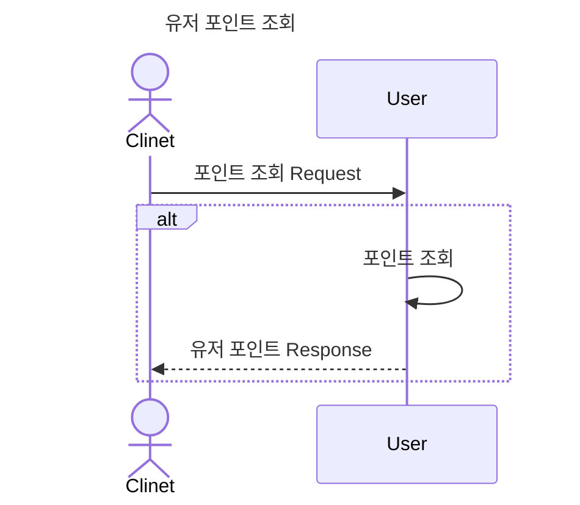
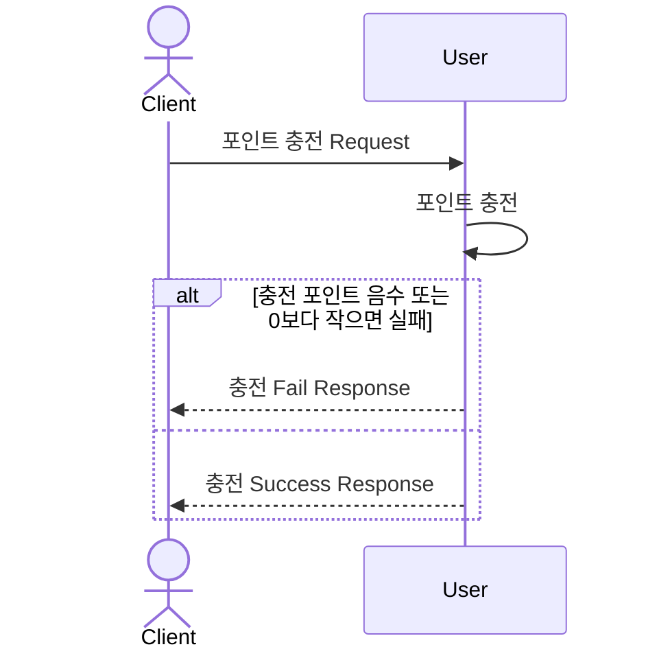
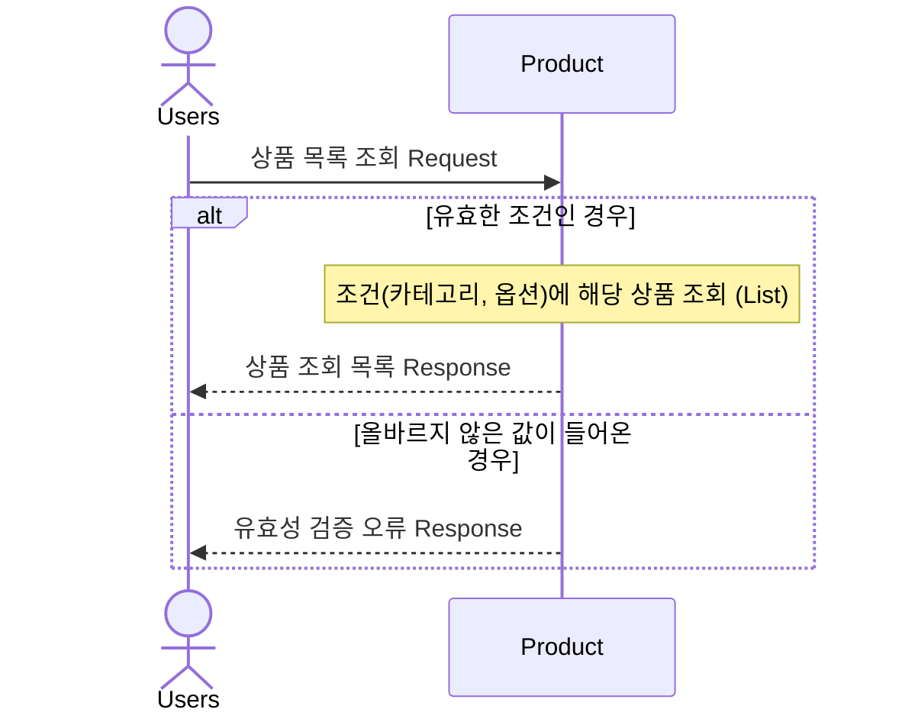
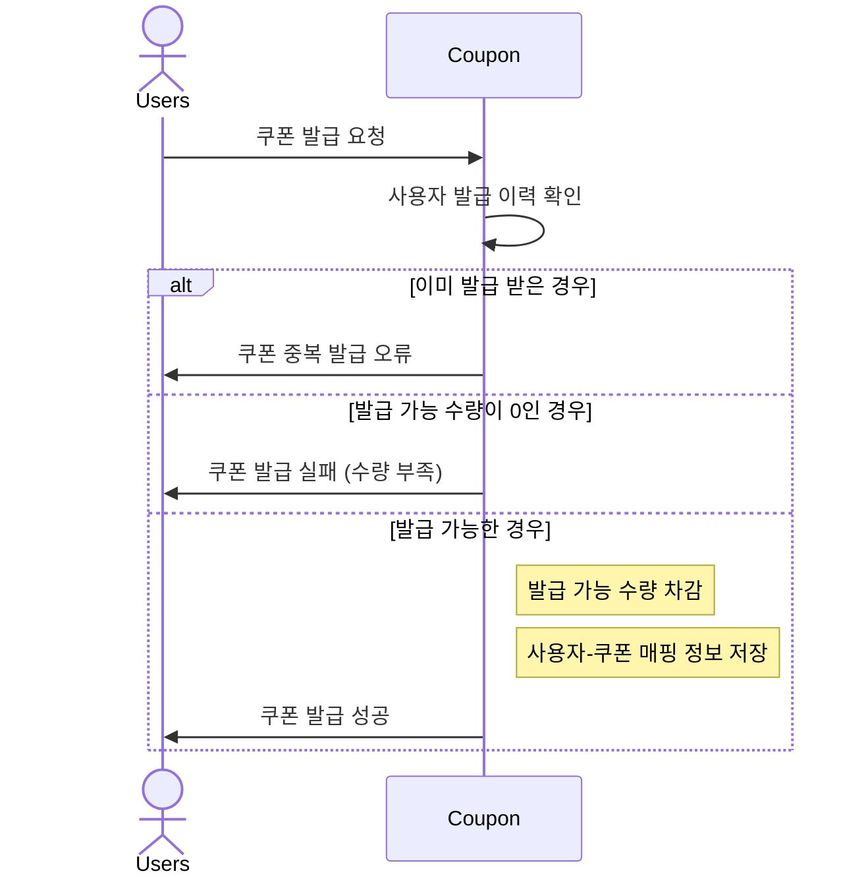
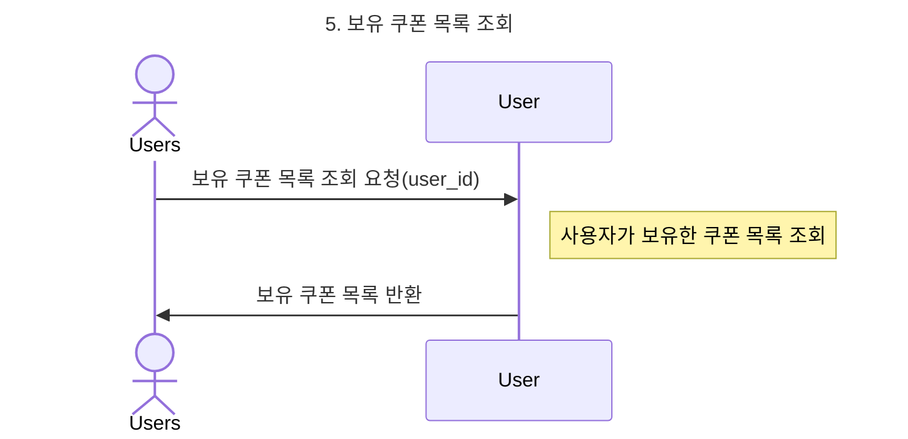
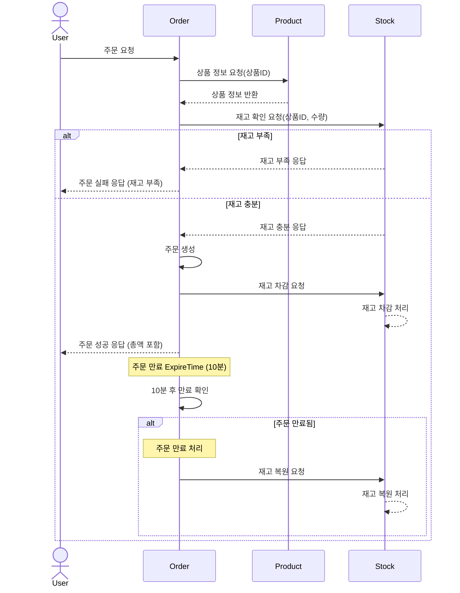
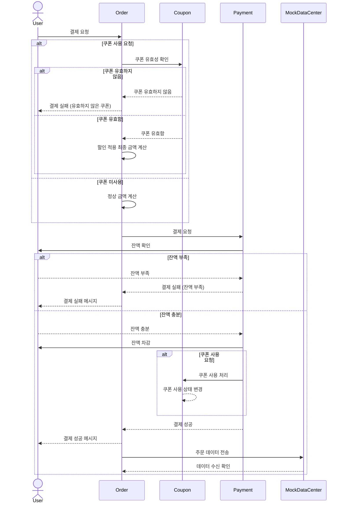

#### 1. 유저 포인트 조회
- Request : user_id



### 2. 포인트 충전
- Request : user_id, amount


### 3. 상품 조회



### 4. 쿠폰 발급



### 5. 쿠폰 조회




### 6. 주문 



### 7. 결제



### 8. 인기 상품 조회
```mermaid
sequenceDiagram
    actor Users
    participant HotProduct
    
    Users->>HotProduct: 상위 판매 상품 조회 요청
        Note right of DailyOrderStats: 상위 상품 목록 조회
-->>Users: 상위 상품 목록 반환
```