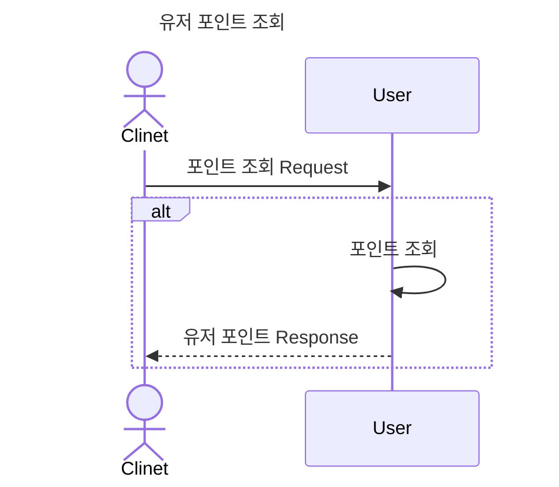
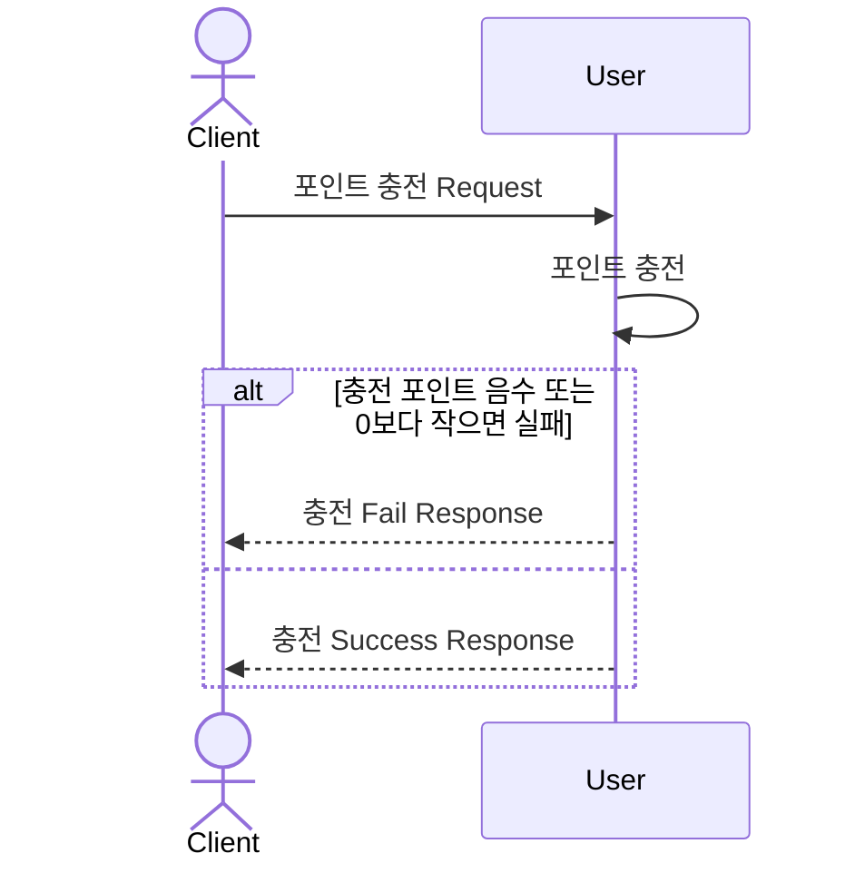
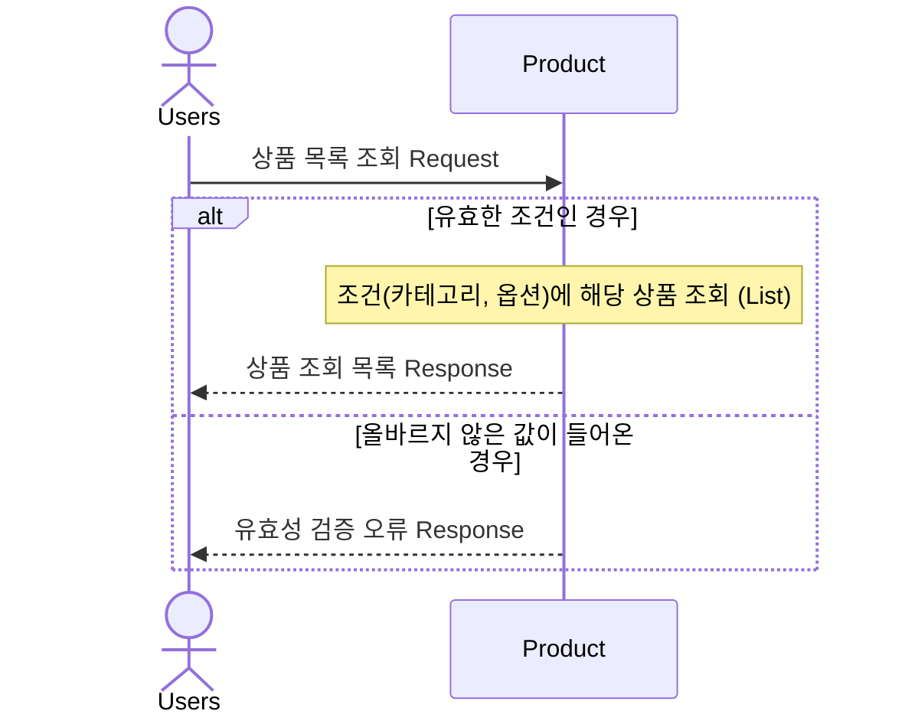

# 1. 유저

- 포인트
  - 포인트 조회
  - 포인트 충전

```mermaid

sequenceDiagram
    title: 유저 포인트 조회
actor Clinet

Clinet->>User:포인트 조회 Request
alt 
    User->>User: 포인트 조회
    User-->>Clinet: 유저 포인트 Response
end
```

```mermaid
sequenceDiagram
    actor Client
    participant User
    
    Client->>User: 포인트 충전 Request
    User->>User: 포인트 충전
    
    alt 충전 포인트 음수 또는 0보다 작으면 실패
        User-->>Client: 충전 Fail Response
    else
        User-->>Client: 충전 Success Response
    end
```

### 2. 상품
- 조회 ( ID, 이름, 가격, 잔여수량)
    - 단일, 전체
    - **조회 시점에 상품별 잔여수량이 정확해야한다.**

```mermaid
sequenceDiagram
    actor Users
    participant Product
    
    Users->>Product: 상품 목록 조회 Request
    
    alt 유효한 조건인 경우
        Note over Product: 조건(카테고리, 옵션)에 해당 상품 조회 (List)
        Product-->>Users: 상품 조회 목록 Response
    else 올바르지 않은 값이 들어온 경우
        Product-->>Users: 유효성 검증 오류 Response
    end
```

