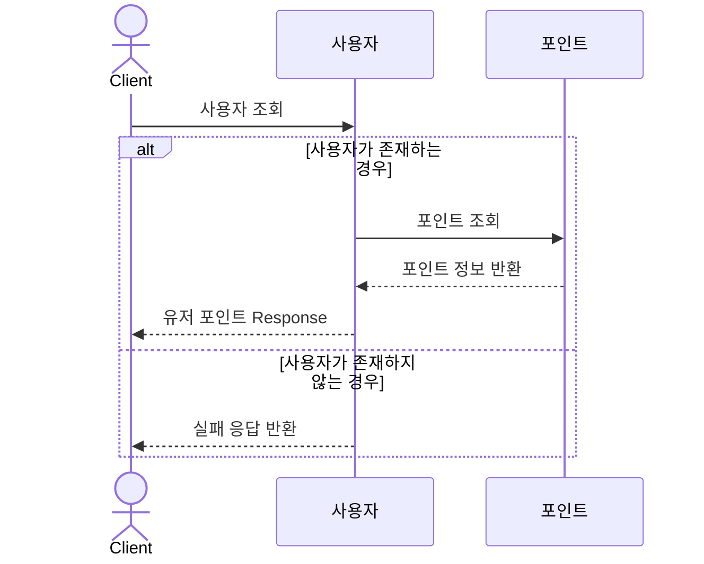
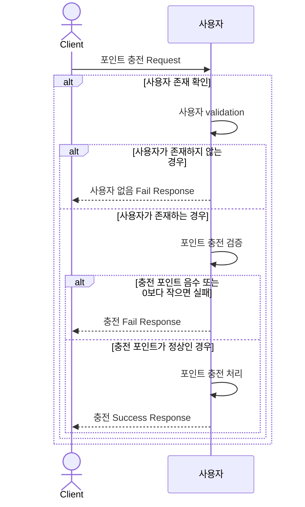
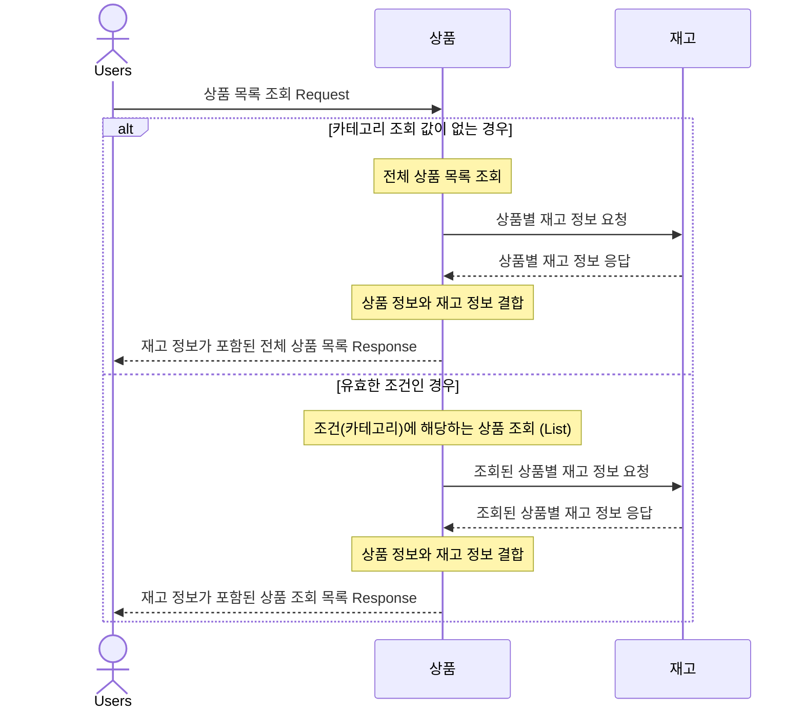
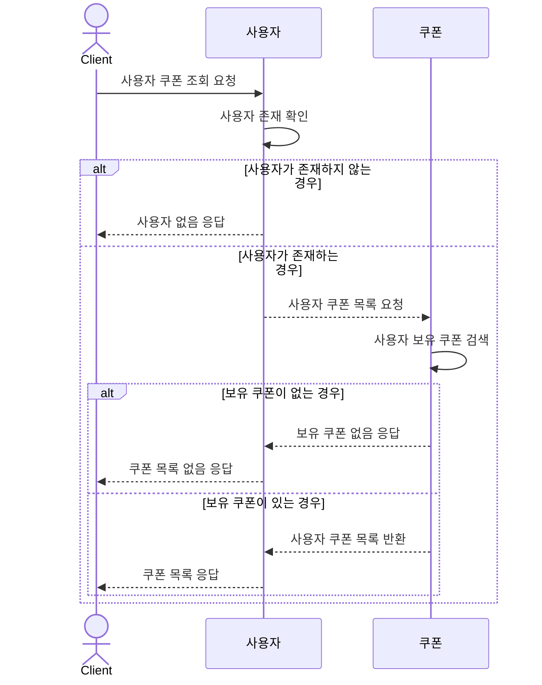
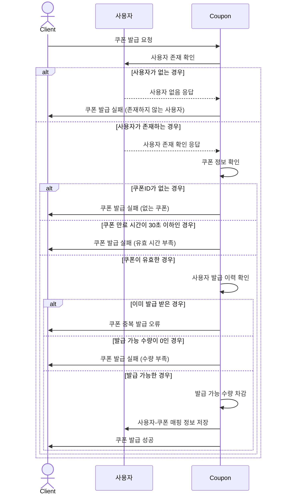
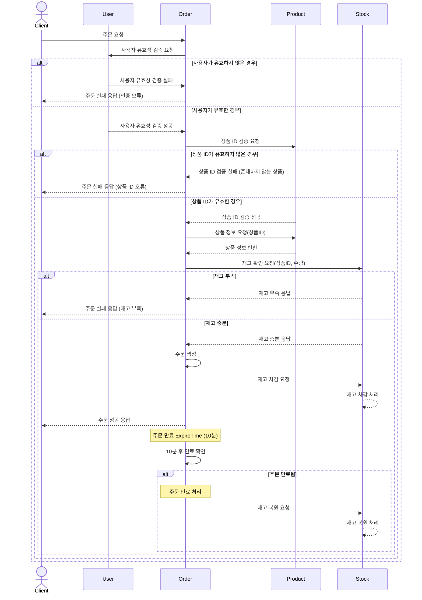
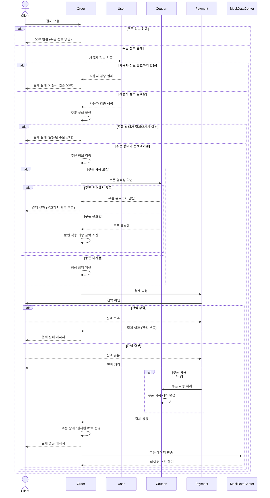
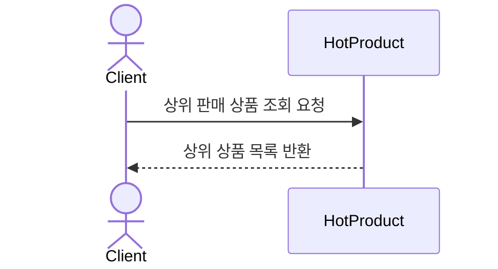

### 0. 초기 데이터
- 사용자, 쿠폰, 상품은 초기 데이터로 세팅을 합니다.

### 1. 유저 포인트 조회

- 기능 : 사용자 포인트 조회를 합니다.
- 검증 : 사용자의 userId를 검증합니다.

### 2. 포인트 충전

- 기능 : 사용자 포인트를 충전합니다.
- 검증
  - 사용자의 userId를 검증합니다.
  - 충전 포인트 음수, 0을 검증합니다.

### 3. 상품 조회
- 기능 : 상품의 정보와 재고를 조회합니다.
  - 카테고리에 해당하는 상품을 조회합니다.
- 검증
    - 필터 값이 없으면 전체 상품을 조회합니다.
    - 필터가 있으면 해당 카테고리의 상품을 조회합니다.

### 4. 사용자 쿠폰 조회
- 기능 : 사용자의 쿠폰을 조회합니다.
- 검증
    - 사용자를 검증합니다.
    - 보유 쿠폰 없으면 쿠폰 목록이 없다고 응답합니다.
    - 보유 쿠폰이 있으면 쿠폰 목록을 응답합니다.

### 5. 쿠폰 발급
- 기능 : 사용자가 쿠폰을 발급합니다.
- 검증
    - 사용자를 검증합니다.
    - 쿠폰 ID가 없으면 실패합니다.
    - 쿠폰 만료 시간이 30초 이하인 경우 발급이 실패합니다.
    - 이미 발급 받은 경우 실패합니다.
    - 쿠폰 발급 수량이 0인 경우 실패합니다.
- 성공
  - 발급이 성공하면 쿠폰의 수량을 차감합니다.
  - 사용자와 쿠폰 매ㅊ핑 정보를 저장합니다.

### 6. 주문
- 기능 : 사용자가 N개의 상품을 주문합니다. ( 상태 : 결제대기 )
- 검증
    - 사용자를 검증합니다.
    - 상품 ID를 검증합니다.
    - 재고를 검증합니다.
- 성공
    - N개의 상품을 주문목록에 생성됩니다.
    - 주문은 10분의 ExpireTime 가집니다.
    - 10분이 지나면 `결제실패` 상태가 바뀌면서 재고가 복원됩니다.

### 7. 결제

- 기능 : 사용자가 결제대기 상태의 주문을 결제하는 기능입니다.

- 검증
  - 사용자 검증: 유효한 사용자인지 확인합니다.
  - 주문 정보 확인: 주문이 존재하는지 확인합니다.
  - 주문 상태 확인: 주문 상태가 '결제대기'인지 확인합니다.
  - 쿠폰 검증: 쿠폰 사용 시 쿠폰의 유효성을 확인합니다.

- 프로세스

### 프로세스

1. 사용자가 결제 요청을 보냅니다.
2. 시스템은 주문 정보 존재 여부를 확인합니다.
3. 시스템은 사용자 정보를 검증합니다.
4. 시스템은 주문 상태가 '결제대기'인지 확인합니다.

5. 쿠폰 사용 여부에 따른 처리:
    - **쿠폰 사용 시**: 쿠폰 유효성 확인 후 할인된 금액을 계산합니다.
    - **쿠폰 미사용 시**: 정상 금액을 계산합니다.

6. 결제 시스템에 결제를 요청합니다.
7. 잔액이 충분한 경우 다음 단계를 진행합니다:
    - 사용자의 잔액을 차감합니다.
    - 쿠폰 사용 시 쿠폰 상태를 변경합니다.
    - 주문 상태를 '결제완료'로 변경합니다.
    - 결제 성공 메시지를 사용자에게 전송합니다.
    - 주문 데이터를 데이터센터로 전송합니다.

### 8. 인기 상품 조회

